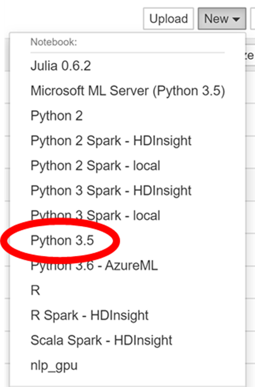
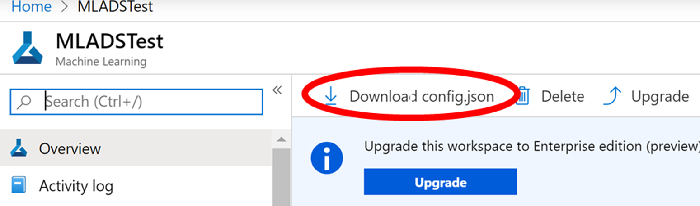

# MLADs2019Fall-Interpretability
This is a repo for use in our MLADs Lab in Fall 2019.

## 1. Get access to the notebook VM
Registration URL : http://bit.ly/32yBHhI

Fill out name, email, etc.

An email from CloudLabs with access link and password should follow in 10 – 15 minutes.​

Please use Chrome to open the access link! Use Incognito.

## 2. Setup the kernel and environment

In the New menu, create a Python 3.5 notebook:

Select Python 3.5

Enter this in the first cell of notebook:

> !git clone https://github.com/bethz/MLADs2019Fall-Interpretability.git​
> 
> !python -m pip install azureml-contrib-interpret azureml-sdk --upgrade​

Then, execute the cell by typing shift-enter.

At this point, you have the files needed for the lab.

## 3. Start the first notebook

From the jupyter root directory, go to:​

/MLADs2019Fall-Interpretability/MLADS-Local/​

Launch this file:
> blackbox-simple-feature-transformations-explain-local.ipynb

## 4. Setup the second notebook

Go back to the email you received from CloudLabs and reference:
- the On Demand Lab Azure Machine Learning ODSC username and password​
- the amlWorkspaceName

Go to portal.azure.com
It will ask for username and password. Enter the username and password. 
Note: do NOT use the AdminUsername and adminPassword.

In the portal, search for the amlWorkspaceName that you copied from the CloudLabs email (quick-starts-ws-xxxxxx).
Select the amlWorkspaceName.

Download config.json by selecting download config.json.

Upload it to root

## Start the second notebook
Launch blackbox-train-explain-model-on-amlcompute-and-deploy.ipynb

