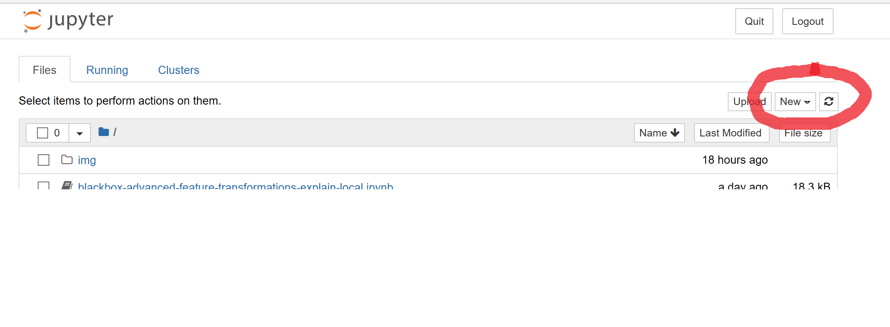

# MLADs2019Fall-Interpretability
This is a repo for use in our MLADs Lab in Fall 2019.

## 1. Get access to the notebook VM
Registration URL : http://bit.ly/32yBHhI

Fill out name, email, etc.

An email with access link and password should follow in 10 – 15 minutes.​

Please use Chrome to open! Use Incognito.

## 2. Setup the kernel and environment

In the New menu, create a Python 3.5 notebook:

Select Python 3.5

Enter this in the first cell of notebook:

!git clone https://github.com/bethz/MLADs2019Fall-Interpretability.git​

!python -m pip install azureml-contrib-interpret --upgrade​

Then, execute the cell. 
At this point, you have the files needed for the lab.

## Start the first notebook

From the jupyter root directory, go to:​

/MLADs2019Fall-Interpretability/MLADS-Local/​

blackbox-simple-feature-transformations-explain-local.ipynb

## Setup the second notebook
Go back to the email you received and get the Azure Machine Learning ODSC username and password​

Use them to access portal.azure.com​

Go to the created Azure ML resource (quick-starts-ws-*)​

Download config.json and upload it to root

## Start the second notebook
Launch blackbox-train-explain-model-on-amlcompute-and-deploy.ipynb

